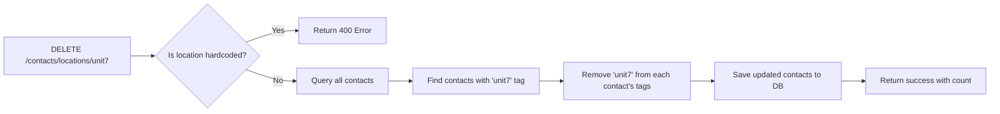

## `/contacts/locations/{location_tag}` Endpoint - DELETE

### Overview

This is a **DELETE** endpoint that removes a dynamic location tag from **all contacts** that have it in the database.

### Endpoint Details

| Property | Value |
|----------|-------|
| **Method** | `DELETE` |
| **Path** | `/contacts/locations/{location_tag}` |
| **Authentication** | Required (Contact Manager role) |
| **Full URL** | `http://localhost:8000/contacts/locations/{location_tag}` |

---

### Request

#### Path Parameter
| Parameter | Type | Description | Example |
|-----------|------|-------------|---------|
| `location_tag` | `string` | The location tag to delete | `"unit7"`, `"unit_7"`, `"new_area"` |

#### Example cURL Request
```bash
curl -X DELETE "http://localhost:8000/contacts/locations/unit7" \
  -H "Authorization: Bearer <your_token>"
```

---

### Response

#### Success Response (200 OK)
```json
{
  "success": true,
  "deleted_location": "unit7",
  "contacts_updated": 15,
  "message": "Successfully removed location 'unit7' from 15 contacts"
}
```

#### Error Responses

**400 Bad Request** - Attempting to delete a hardcoded location:
```json
{
  "detail": "Cannot delete hardcoded location 'kanana'. Allowed hardcoded locations: kanana, kekana, majaneng, mashemong, soshanguve"
}
```

**500 Internal Server Error** - Unexpected error:
```json
{
  "detail": "Error message describing the failure"
}
```

---

### How It Affects Contacts



#### Step-by-Step Process

1. **Validation**: Checks if the location tag is in the hardcoded list
2. **Query**: Finds ALL contacts that have this location tag
3. **Update**: For each contact, removes the tag from their tags list
4. **Save**: Persists the changes to the database
5. **Return**: Reports how many contacts were updated

---

### Hardcoded Locations (Cannot Be Deleted)

These 5 location tags are protected and **cannot** be deleted:

| Tag | Description |
|-----|-------------|
| `kanana` | Primary location area |
| `majaneng` | Location area |
| `mashemong` | Location area |
| `soshanguve` | Location area |
| `kekana` | Location area |

---

### Impact on Individual Contacts

**Before deletion** (`location_tag = "unit7"`):
```json
{
  "id": 123,
  "name": "John Doe",
  "phone": "0712345678",
  "tags": ["member", "worshiper", "unit7"]
}
```

**After deletion**:
```json
{
  "id": 123,
  "name": "John Doe",
  "phone": "0712345678",
  "tags": ["member", "worshiper"]
}
```

The contact is **not deleted** - only the location tag is removed from their tags array.

---

### Use Cases

1. **Clean up temporary location tags** - Remove tags created for events or temporary groups
2. **Correct tagging mistakes** - Remove incorrectly applied location tags
3. **Archive old location groupings** - Remove deprecated location structures

---

### Related Endpoints

| Endpoint | Description |
|----------|-------------|
| [`GET /contacts/dashboard/statistics`](app/routers/contacts.py:423) | View all location tag counts |
| [`GET /contacts/tags/statistics`](app/routers/contacts.py:414) | Get tag usage statistics |
| [`PUT /contacts/{id}/tags`](app/routers/contacts.py:366) | Replace a single contact's tags |