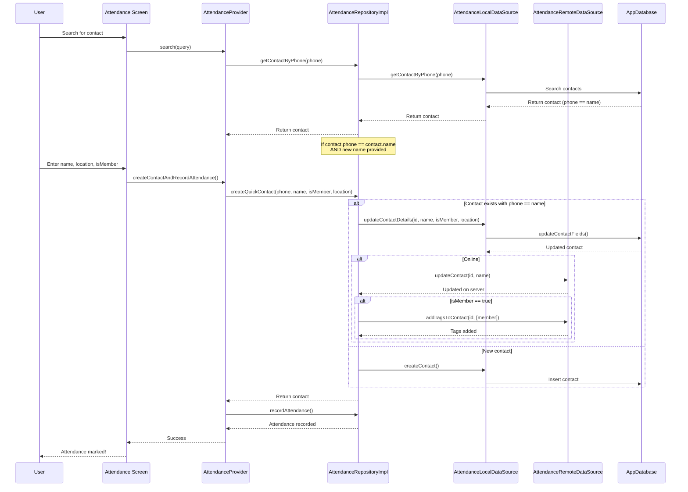

# Plan: Fix Attendance Marking for Contacts where phone == name

## Problem Summary

When marking attendance via the PRIMARY method (search contacts), if a contact exists where `phone == name` (meaning the name field equals the phone number because no real name was entered), the app CANNOT update that contact with:
- Real name
- Tags (like "member")
- Location

The current code in `attendance_repository_impl.dart` simply returns the existing contact without updating it.

## Root Cause

In [`attendance_repository_impl.dart`](lib/features/attendance/data/repositories/attendance_repository_impl.dart:126-140), the `createQuickContact` method:

```dart
final existingContact = await _localDataSource.getContactByPhone(phone);
if (existingContact != null) {
  // Return existing contact instead of creating duplicate
  return existingContact;  // <-- BUG: No update happens here!
}
```

## Implementation Plan

### 1. Add Update Method to AttendanceLocalDataSource
**File**: `lib/features/attendance/data/datasources/attendance_local_datasource.dart`

Add a method to update an existing contact with new name, tags, and location:
- Method: `updateContactDetails(int contactId, String? name, bool isMember, String? location)`
- Uses existing `updateContactFields` from database

### 2. Add Update Method to AttendanceRemoteDataSource
**File**: `lib/features/attendance/data/datasources/attendance_remote_datasource.dart`

Add methods to update contact on backend:
- `updateContact(int contactId, {String? name, String? phone, String? status, bool? optOutSms})` - PUT /contacts/{contact_id}
- `addTagsToContact(int contactId, List<String> tags)` - POST /contacts/{contact_id}/tags/add

### 3. Modify AttendanceRepositoryImpl
**File**: `lib/features/attendance/data/repositories/attendance_repository_impl.dart`

Update `createQuickContact` method to:
- Check if existing contact has `phone == name`
- If so, update the contact with new name, tags, and location
- Sync updates to backend (both contact update and tags)

### 4. Flow Diagram



## Files to Modify

| File | Changes |
|------|---------|
| `lib/features/attendance/data/datasources/attendance_local_datasource.dart` | Add `updateContactDetails()` method |
| `lib/features/attendance/data/datasources/attendance_remote_datasource.dart` | Add `updateContact()` and `addTagsToContact()` methods |
| `lib/features/attendance/data/repositories/attendance_repository_impl.dart` | Modify `createQuickContact()` to update existing contacts |

## Backend API Endpoints Used

- `PUT /contacts/{contact_id}` - Update contact details
- `POST /contacts/{contact_id}/tags/add` - Add tags to contact

## Notes

- The existing `updateContactFields` method in database.dart already supports updating name, metadata, and isSynced
- The Contact model stores tags in the metadata JSON field
- Need to merge tags carefully (add new tags without removing existing ones)
