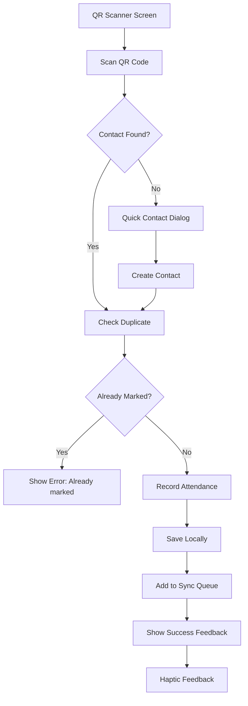

# Attendance Recording Implementation Plan

## Overview

This document outlines the implementation plan for the Attendance Recording feature following Clean Architecture principles. The feature allows recording attendance via QR code scanning with offline-first support.

## Architecture Flow



## QR Code System

### QR Code Content
- QR code contains: **Just the phone number** (e.g., `+27821234567`)
- Simple, clean, WhatsApp-friendly

### QR Code Eligibility
Generate QR codes **only** for contacts where:
1. `name != phone` (has a real name, not just phone number)
2. Contact has `'member'` tag in metadata

The [`Contact`](lib/features/contacts/domain/models/contact.dart:51) model already has this built-in:
```dart
bool get isEligibleForQRCode {
  return name != null && name != phone && hasTag('member');
}
```

### QR Code Flow
```
Contact List
    | [Tap QR icon on member card]
QR Bottom Sheet opens
    | Shows QR code + contact info
    | [Tap Share via WhatsApp]
WhatsApp opens
    | User sends to member
Member receives QR code
    | Shows at church
Servant scans QR code
    | Attendance recorded
```

## Clean Architecture Layers

### Domain Layer

#### Repository Interface
**File:** `lib/features/attendance/domain/repositories/attendance_repository.dart`

```dart
abstract class AttendanceRepository {
  Future<Attendance> recordAttendance({
    required int contactId,
    required String phone,
    required ServiceType serviceType,
    required DateTime serviceDate,
    required int recordedBy,
  });
  
  Future<bool> checkDuplicateAttendance({
    required int contactId,
    required DateTime serviceDate,
    required ServiceType serviceType,
  });
  
  Future<List<Attendance>> getAttendancesByDateRange(DateTime from, DateTime to);
  Future<List<Attendance>> getAttendancesByContact(int contactId);
}
```

### Data Layer

#### Local DataSource
**File:** `lib/features/attendance/data/datasources/attendance_local_datasource.dart`

Responsibilities:
- Insert attendance records into local database
- Check for duplicate attendance
- Query attendance by date range and contact
- Convert between entity and model

#### Remote DataSource
**File:** `lib/features/attendance/data/datasources/attendance_remote_datasource.dart`

Responsibilities:
- POST to `/attendance/record` endpoint
- GET attendance records from server
- Handle API errors

#### Repository Implementation
**File:** `lib/features/attendance/data/repositories/attendance_repository_impl.dart`

Responsibilities:
- Coordinate between local and remote data sources
- Add items to sync queue for offline support
- Handle sync status updates

### Presentation Layer

#### Provider
**File:** `lib/features/attendance/presentation/providers/attendance_provider.dart`

State management using Riverpod:
- `AttendanceNotifier` - Manages attendance state
- `attendanceProvider` - StateNotifierProvider
- Recording attendance with loading/error states

#### Screens

**QR Scanner Screen:** `lib/features/attendance/presentation/screens/qr_scanner_screen.dart`
- Uses `mobile_scanner` package
- Service type selector
- Handles scan results
- Shows success/error feedback

**Attendance Screen:** `lib/features/attendance/presentation/screens/attendance_screen.dart`
- Service type selection
- Navigate to QR scanner
- History icon button with TODO for history screen

#### Widgets

**Quick Contact Dialog:** `lib/features/attendance/presentation/widgets/quick_contact_dialog.dart`
- Simple form: name + member checkbox
- NOT automatically adding member tag
- Returns new contact for attendance recording

## Key Implementation Details

### 1. Duplicate Check Logic

```dart
Future<bool> checkDuplicateAttendance({
  required int contactId,
  required DateTime serviceDate,
  required ServiceType serviceType,
}) async {
  final existing = await _db.checkAttendanceExists(
    contactId,
    serviceDate,
    serviceType.backendValue,
  );
  return existing != null;
}
```

### 2. Recording Flow

```dart
Future<Attendance> recordAttendance({
  required int contactId,
  required String phone,
  required ServiceType serviceType,
  required DateTime serviceDate,
  required int recordedBy,
}) async {
  // 1. Check duplicate
  if (await checkDuplicateAttendance(...)) {
    throw AttendanceException.duplicate;
  }
  
  // 2. Create attendance record
  final attendance = Attendance(
    id: 0, // Auto-generated
    contactId: contactId,
    phone: phone,
    serviceType: serviceType,
    serviceDate: serviceDate,
    recordedBy: recordedBy,
    recordedAt: DateTime.now(),
    isSynced: false,
  );
  
  // 3. Save locally
  final created = await _localDataSource.create(attendance);
  
  // 4. Add to sync queue
  await _addToSyncQueue(created);
  
  return created;
}
```

### 3. Quick Contact Creation

When QR scanned but contact not found:
1. Show dialog with name input
2. Checkbox for member - NOT auto-checked
3. Create contact with phone from QR
4. Proceed with attendance recording

### 4. Success Feedback

```dart
// Visual feedback
ScaffoldMessenger.showSnackBar(
  SnackBar(
    content: Text('Marked: ${contact.name}'),
    backgroundColor: Colors.green,
    duration: Duration(seconds: 2),
  ),
);

// Haptic feedback
HapticFeedback.mediumImpact();
```

## Edge Cases

| Case | Handling |
|------|----------|
| QR scan - contact not found | Show quick contact dialog |
| Already marked today | Show error message with service type |
| Offline | Save locally, add to sync queue |
| Invalid phone format | Validate before processing |
| Server error | Save locally, retry later via sync |

## Files to Create

```
lib/features/attendance/
  domain/
    repositories/
      attendance_repository.dart         # NEW
  data/
    datasources/
      attendance_local_datasource.dart   # NEW
      attendance_remote_datasource.dart  # NEW
    repositories/
      attendance_repository_impl.dart    # NEW
  presentation/
    providers/
      attendance_provider.dart           # NEW
    screens/
      qr_scanner_screen.dart             # NEW
      attendance_screen.dart             # UPDATE
    widgets/
      quick_contact_dialog.dart          # NEW
```

## Dependencies

Add to `pubspec.yaml`:
```yaml
dependencies:
  mobile_scanner: ^5.1.1    # QR code scanning
  qr_flutter: ^4.1.0        # QR code generation
  share_plus: ^7.2.1        # Share via WhatsApp
  path_provider: ^2.1.2     # Already included - for temp files
```

## Android Permissions

Add to `android/app/src/main/AndroidManifest.xml`:
```xml
<!-- Camera for QR scanning -->
<uses-permission android:name="android.permission.CAMERA" />

<!-- Optional: Vibration feedback -->
<uses-feature android:name="android.hardware.camera" />
<uses-feature android:name="android.hardware.camera.autofocus" />
```

## API Endpoint

**POST /attendance/record**

Request:
```json
{
  "contact_id": 123,
  "phone": "+27821234567",
  "service_type": "Sunday",
  "service_date": "2024-01-14T09:00:00Z",
  "recorded_by": 1
}
```

Success Response (201):
```json
{
  "id": 1,
  "contact_id": 123,
  "phone": "+27821234567",
  "service_type": "Sunday",
  "service_date": "2024-01-14T09:00:00Z",
  "recorded_by": 1,
  "recorded_at": "2024-01-14T10:30:00Z"
}
```

Error Response (400):
```json
{
  "detail": "Attendance already recorded for this contact on 2024-01-14 for Sunday"
}
```

## Implementation Order

1. Add `mobile_scanner` dependency
2. Create domain layer - repository interface
3. Create data layer - datasources and repository
4. Create presentation layer - provider
5. Create quick contact dialog widget
6. Create QR scanner screen
7. Update attendance screen with navigation
8. Run code generation
9. Test the complete flow

## TODO for Future

- [ ] Implement history screen
- [ ] Add attendance statistics
- [ ] Add export functionality
- [ ] Add bulk attendance recording