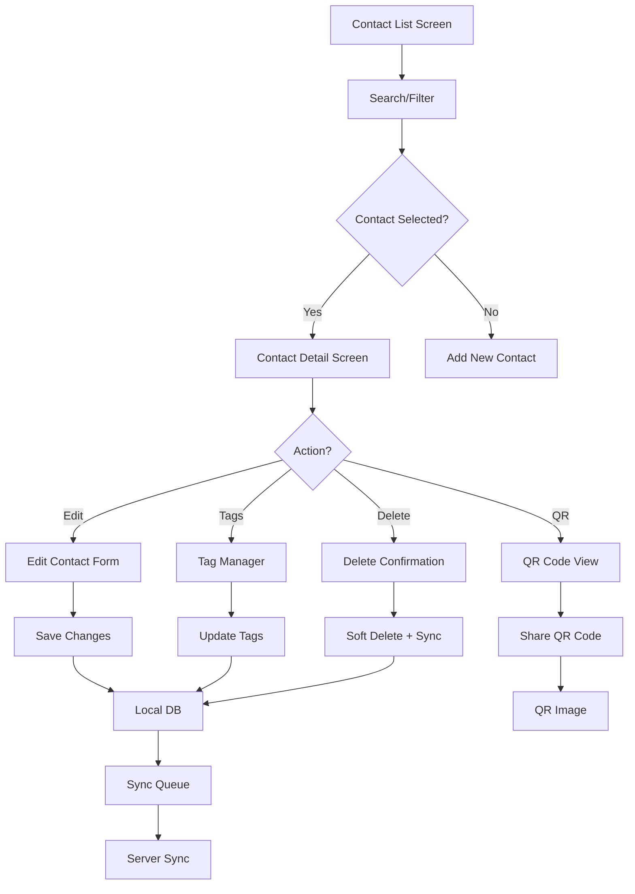

# Contact Feature Implementation Plan

## Overview

The Contact feature is a full Contact Manager that extends beyond simple contact creation and updates. It provides comprehensive contact management capabilities including search, filtering, tag management, and QR code generation.

## Current State Analysis

### Already Implemented

| Component | Status | Notes |
|-----------|--------|-------|
| Contact Model | ✅ Complete | Has id, name, phone, metadata_, tags, isDeleted fields |
| ContactRepository Interface | ✅ Complete | Includes deleteContact(), getAllTags(), addTagsToContact(), removeTagsFromContact() |
| Contact QR Code Widget | ⚠️ Partial | Shows QR but doesn't include metadata-based icons |
| QR Share Button | ✅ Complete | Generates QR image and shares via WhatsApp |
| QR Bottom Sheet | ✅ Complete | Modal for displaying QR code |
| Contact Card Widget | ✅ Complete | Displays contact with avatar, name, phone, tags |
| Contact Count Provider | ✅ Complete | Provides offline contact count |

### Not Yet Implemented

| Component | Status | Notes |
|-----------|--------|-------|
| Contacts Screen | ❌ Placeholder | Shows "Coming Soon" |
| Contact Detail Screen | ❌ Missing | For editing/deleting contacts |
| Contact Local DataSource | ❌ Missing | For CRUD operations |
| Contact Remote DataSource | ❌ Missing | For server sync |
| Contact Repository Implementation | ❌ Missing | Concrete implementation |
| Tag Categories | ⚠️ Partial | Only 'member' and locations exist |
| QR with Metadata Icons | ❌ Missing | Icons based on contact role |

---

## Feature Requirements

### 1. Contact Deletion
- Soft delete (mark as deleted in database)
- Add to sync queue for server deletion
- Option to restore deleted contacts (optional)

### 2. Tag Categories
New predefined tags with associated icons:

| Tag | Display Name | Icon | Description |
|-----|--------------|------|-------------|
| `pastor` | Pastor | `Icons.church` | Church pastor/leadership |
| `protocol` | Protocol | `Icons.event_note` | Protocol team member |
| `worshiper` | Worshiper | `Icons.volunteer_activism` | Regular worshipper |
| `usher` | Usher | `Icons.door_front_door` | Usher team |
| `financer` | Finance | `Icons.account_balance` | Finance team member |
| `servant` | Servant | `Icons.handshake` | General servant/worker |
| `member` | Member | `Icons.card_membership` | Church member (existing) |

### 3. QR Code Enhancement
- Display contact's primary role icon in QR code view
- Include contact metadata in QR data structure
- Generate unique QR per contact with their role-based icon

### 4. Contact Screens

#### Screen 1: Contact List Screen (Main)
- Search contacts by name or phone
- Filter by tag/category
- Display contact cards with role icons
- Tap to view contact details
- FAB to add new contact

#### Screen 2: Contact Management Screen
- View full contact details
- Edit name, phone
- Manage tags (add/remove)
- View/generate QR code
- Delete contact
- View attendance history (optional)

---

## Architecture Flow



---

## Implementation Plan

### Phase 1: Data Layer Updates

#### 1.1 Create Contact Local DataSource
**File:** `lib/features/contacts/data/datasources/contact_local_datasource.dart`

```dart
class ContactLocalDataSource {
  // Get all contacts (excluding deleted)
  Future<List<ContactEntity>> getAllContacts();
  
  // Get contacts by tag
  Future<List<ContactEntity>> getContactsByTag(String tag);
  
  // Search contacts
  Future<List<ContactEntity>> searchContacts(String query);
  
  // CRUD operations
  Future<ContactEntity> createContact(ContactEntity contact);
  Future<ContactEntity> updateContact(ContactEntity contact);
  Future<void> softDeleteContact(int id);
  Future<void> restoreContact(int id);
  
  // Tag management
  Future<void> addTagsToContact(int contactId, List<String> tags);
  Future<void> removeTagsFromContact(int contactId, List<String> tags);
}
```

#### 1.2 Create Contact Remote DataSource
**File:** `lib/features/contacts/data/datasources/contact_remote_datasource.dart`

```dart
class ContactRemoteDataSource {
  // Fetch all contacts from server
  Future<List<Map<String, dynamic>>> getContacts();
  
  // Create contact on server
  Future<Map<String, dynamic>> createContact(Map<String, dynamic> data);
  
  // Update contact on server
  Future<Map<String, dynamic>> updateContact(int id, Map<String, dynamic> data);
  
  // Delete contact on server
  Future<void> deleteContact(int id);
  
  // Tag operations
  Future<void> addTagsToContact(int id, List<String> tags);
  Future<void> removeTagsFromContact(int id, List<String> tags);
}
```

#### 1.3 Create Contact Repository Implementation
**File:** `lib/features/contacts/data/repositories/contact_repository_impl.dart`

- Implements ContactRepository interface
- Coordinates local and remote data sources
- Handles offline-first sync strategy

---

### Phase 2: Domain Layer Updates

#### 2.1 Update Contact Model
**File:** `lib/features/contacts/domain/models/contact.dart`

Add helper methods:
```dart
// Get primary role tag (for icon display)
String? get primaryRoleTag;

// Get icon for primary role
IconData get roleIcon;

// Check if contact has specific role
bool hasRole(String role);

// Get all available roles from tags
List<String> get roles;
```

#### 2.2 Create Tag Enum/Constants
**File:** `lib/core/enums/contact_tag.dart` (NEW)

```dart
enum ContactTag {
  // Role tags - these are ministry/position tags
  pastor('pastor', 'Pastor', Icons.church, Colors.purple),
  protocol('protocol', 'Protocol', Icons.event_note, Colors.blue),
  worshiper('worshiper', 'Worshiper', Icons.volunteer_activism, Colors.green),
  usher('usher', 'Usher', Icons.door_front_door, Colors.orange),
  financier('financier', 'Finance', Icons.account_balance, Colors.teal),
  servant('servant', 'Servant', Icons.handshake, Colors.indigo),
  
  // Membership status (boolean - contact either has it or not)
  member('member', 'Member', Icons.card_membership, Colors.green),
  
  // Location tags (geographic areas - separate from roles!)
  kanana('kanana', 'Kanana', Icons.location_on, Colors.red),
  majaneng('majaneng', 'Majaneng', Icons.location_on, Colors.red),
  mashemong('mashemong', 'Mashemong', Icons.location_on, Colors.red),
  soshanguve('soshanguve', 'Soshanguve', Icons.location_on, Colors.red),
  kekana('kekana', 'Kekana', Icons.location_on, Colors.red);
  
  // Properties and methods
}
```

---

### Phase 3: Presentation Layer - Screens

#### 3.1 Contact List Screen (Main)
**File:** `lib/features/contacts/screens/contact_list_screen.dart` (NEW - replaces contacts_screen.dart)

Features:
- AppBar with search icon
- Search field (expandable)
- Filter chips for tags
- Contact list with ContactCard widgets
- FAB for adding new contact
- Pull to refresh

```dart
class ContactListScreen extends ConsumerStatefulWidget {
  const ContactListScreen({super.key});
}

class ContactListScreenState extends State<ContactListScreen> {
  // Search controller
  // Selected tags filter
  // Contact list state
  
  @override
  Widget build(BuildContext context) {
    // Scaffold
    // AppBar with title and search
    // Filter chips row
    // ContactListView
    // FAB
  }
}
```

#### 3.2 Contact Detail Screen
**File:** `lib/features/contacts/screens/contact_detail_screen.dart` (NEW)

Features:
- Contact header with avatar, name, phone
- Tag chips display
- Edit button in AppBar
- QR Code section
- Delete button
- Attendance history (optional)

```dart
class ContactDetailScreen extends ConsumerWidget {
  final Contact contact;
  
  const ContactDetailScreen({super.key, required this.contact});
  
  @override
  Widget build(BuildContext context) {
    // Scaffold
    // AppBar with edit action
    // Contact header
    // Tag manager section
    // QR Code section
    // Delete button
  }
}
```

#### 3.3 Contact Edit Screen
**File:** `lib/features/contacts/screens/contact_edit_screen.dart` (NEW)

Features:
- Form fields: name, phone
- Tag selector (multi-select chips)
- Save/Cancel buttons
- Validation

#### 3.4 Tag Manager Widget
**File:** `lib/features/contacts/presentation/widgets/tag_manager.dart` (NEW)

Features:
- Display available tags as chips
- Toggle selection
- Visual feedback for selected tags
- Group by category (roles, locations)

---

### Phase 4: QR Code Enhancement

#### 4.1 Update ContactQRCode Widget
**File:** `lib/features/contacts/presentation/widgets/contact_qr_code.dart`

Enhancements:
- Add role icon badge overlay
- Customize QR eye colors based on role
- Include contact name in QR center

```dart
class ContactQRCode extends StatelessWidget {
  final Contact contact;
  final double size;
  final bool showRoleIcon; // NEW: Toggle role icon display
  
  // ... existing code
  
  Widget _buildRoleBadge() {
    // Build icon badge based on primary role
  }
}
```

---

### Phase 5: Providers

#### 5.1 Contact Provider
**File:** `lib/features/contacts/presentation/providers/contact_provider.dart` (NEW)

```dart
// Contact list provider
final contactListProvider = FutureProvider<List<Contact>>;

// Contact search provider
final contactSearchProvider = StateNotifierProvider<ContactSearchNotifier, ContactSearchState>;

// Contact detail provider
final contactDetailProvider = FutureProvider.family<Contact?, int>;

// Tag filter provider
final selectedTagFilterProvider = StateProvider<String?>;

// Contact CRUD notifier
class ContactNotifier extends Notifier<ContactState> {
  // Create, Update, Delete methods
}
```

---

## Database Changes

### Existing Table (No Changes Needed)
The `Contacts` table in [`database.dart`](lib/core/database/database.dart:24) already supports all required fields:
- id, name, phone
- metadata (JSON for tags)
- isDeleted (soft delete)
- isSynced (sync status)

### Sync Queue
Already configured for contact sync in SyncQueue table.

---

## File Structure

```
lib/features/contacts/
├── data/
│   ├── datasources/
│   │   ├── contact_local_datasource.dart    # NEW
│   │   └── contact_remote_datasource.dart   # NEW
│   └── repositories/
│       └── contact_repository_impl.dart     # NEW
├── domain/
│   ├── models/
│   │   └── contact.dart                     # UPDATE - add role methods
│   └── repositories/
│       └── contact_repository.dart          # EXISTS
├── presentation/
│   ├── providers/
│   │   ├── contact_provider.dart            # NEW
│   │   └── contact_search_provider.dart     # EXISTS - may need update
│   ├── screens/
│   │   ├── contact_list_screen.dart         # NEW - replaces contacts_screen.dart
│   │   ├── contact_detail_screen.dart       # NEW
│   │   └── contact_edit_screen.dart        # NEW
│   └── widgets/
│       ├── contact_card.dart                # EXISTS - may need update
│       ├── contact_qr_code.dart             # UPDATE - add role icons
│       ├── qr_bottom_sheet.dart             # EXISTS
│       ├── qr_share_button.dart             # EXISTS
│       └── tag_manager.dart                 # NEW
├── core/enums/
│   └── contact_tag.dart                     # NEW - tag enum
```

---

## Additional Features

### vCard Export/Import (VCF)

Android-compatible contact sharing format for backup and transfer between devices.

**vCard Export Format:**
```
BEGIN:VCARD
VERSION:2.1
N:;Spezas;;;
FN:Spezas
TEL;CELL:+27608939144
TEL;CELL:0608939144
END:VCARD
```

**Export Features:**
- Export single contact from Contact Detail Screen
- Export all contacts (batch export)
- Share via SharePlus (user chooses app)

**Import Features:**
- Import vCard file from storage
- Parse and create contacts in local database
- Handle duplicates (skip or update)
- ❌ Contact Photo - Not required (no camera/gallery needed)
- ❌ Attendance History View - Separate feature
- ❌ SMS/Call - App doesn't support this
- ❌ CSV Import - VCF is better for Android

---

## Implementation Order

1. **Create tag enum/constants** - Define all tag categories
2. **Update Contact model** - Add role helper methods
3. **Create Contact Local DataSource** - CRUD operations
4. **Create Contact Remote DataSource** - Server sync
5. **Create Contact Repository Implementation** - Coordinate datasources
6. **Create Contact Provider** - State management
7. **Create Contact List Screen** - Main screen with search/filter
8. **Create Contact Detail Screen** - View/edit/delete
9. **Create Contact Edit Screen** - Edit form
10. **Create Tag Manager Widget** - Tag selection UI
11. **Update QR Code Widget** - Add role icons
12. **Update Contacts Screen** - Point to new list screen
13. **Test and verify**

---

## Summary

The Contact feature will be a comprehensive Contact Manager with:

| Feature | Description |
|---------|-------------|
| Contact List | Searchable/filterable directory |
| Contact Detail | Full contact view with QR code |
| Contact Edit | Update name, phone, tags |
| Contact Delete | Soft delete with sync |
| Tag Management | Add/remove role tags |
| QR Code | Generate with role-based icons |

This builds on existing infrastructure and follows the same Clean Architecture patterns as the Attendance feature.
