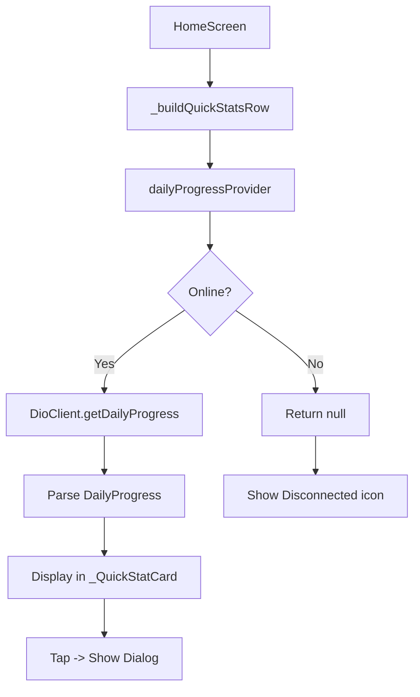

# Daily Progress Feature Implementation Plan

## Overview

This plan outlines the Flutter implementation of the daily progress feature that integrates with the existing `GET /stats/daily-progress` backend endpoint.

---

## Task Requirements

### Backend API (Already Implemented)
- **Endpoint:** `GET /stats/daily-progress`
- **Authentication:** OAuth2 Bearer Token
- **Response Format:**
  ```json
  {
    "date": "2026-03-26",
    "user_id": 1,
    "new_contacts": 5,
    "modified_contacts": 3,
    "total": 8
  }
  ```

### Frontend Changes Required

1. **Add API constant** for the new endpoint in `api_constants.dart`
2. **Add DioClient method** to fetch daily progress data
3. **Create provider** to manage daily progress state
4. **Update home screen** (`_buildQuickStatsRow`):
   - Replace "This Week" with "Progress" card showing total
   - Remove "Synced" card entirely
   - On tap, show dialog with `new_contacts` and `modified_contacts`
5. **Handle offline state**: Show "Disconnected" icon when device is offline

---

## Implementation Steps

### Step 1: Add API Constant
**File:** `lib/core/network/api_constants.dart`

Add new constant:
```dart
static const String dailyProgress = '/stats/daily-progress';
```

### Step 2: Add DioClient Method
**File:** `lib/core/network/dio_client.dart`

Add method to fetch daily progress:
```dart
/// GET /stats/daily-progress
/// Gets daily progress tracking for contacts created and modified by the current user.
Future<Response> getDailyProgress() async {
  return get(ApiConstants.dailyProgress);
}
```

### Step 3: Create Daily Progress Provider
**File:** `lib/features/home/presentation/providers/dashboard_providers.dart`

Add new provider:
```dart
/// Data class for daily progress
class DailyProgress {
  final String date;
  final int userId;
  final int newContacts;
  final int modifiedContacts;
  final int total;

  DailyProgress({
    required this.date,
    required this.userId,
    required this.newContacts,
    required this.modifiedContacts,
    required this.total,
  });

  factory DailyProgress.fromJson(Map<String, dynamic> json) {
    return DailyProgress(
      date: json['date'] ?? '',
      userId: json['user_id'] ?? 0,
      newContacts: json['new_contacts'] ?? 0,
      modifiedContacts: json['modified_contacts'] ?? 0,
      total: json['total'] ?? 0,
    );
  }
}

/// Provider for daily progress data
final dailyProgressProvider = FutureProvider<DailyProgress?>((ref) async {
  // Watch refresh trigger
  ref.watch(dashboardRefreshTriggerProvider);
  
  // Watch online status
  final isOnline = ref.watch(isOnlineProvider);
  if (!isOnline) return null;
  
  try {
    final dioClient = ref.read(dioClientProvider);
    final response = await dioClient.getDailyProgress();
    return DailyProgress.fromJson(response.data);
  } catch (e) {
    return null;
  }
});
```

### Step 4: Update Home Screen Quick Stats Row
**File:** `lib/features/home/presentation/screens/home_screen.dart`

**Current state (4 cards):**
- Contacts
- Members  
- This Week (attendance)
- Synced (pending sync count)

**Target state (3 cards):**
- Contacts
- Members
- Progress (daily progress from API)

#### Changes:

1. **Replace "This Week" with "Progress":**
   - Replace the `weeklyAttendanceCountProvider` with `dailyProgressProvider`
   - Show "Progress" label with total count
   - Color: Use a distinct color (e.g., blue-purple gradient)

2. **Remove "Synced" card:**
   - The 4th column (`pendingSync`) is removed entirely
   - Creates space for the 3-card layout

3. **Add tap handler for dialog:**
   - When user taps the Progress card, show a dialog
   - Dialog shows: new_contacts and modified_contacts
   - Include date in dialog title

4. **Handle offline state:**
   - Check `isOnlineProvider` before calling API
   - If offline, show "Disconnected" icon on the Progress card
   - Display value as "-" or cached value when offline

#### Dialog Design:
```dart
AlertDialog(
  title: Text('Daily Progress - $date'),
  content: Column(
    mainAxisSize: MainAxisSize.min,
    children: [
      _ProgressRow(label: 'New Contacts', value: newContacts),
      _ProgressRow(label: 'Modified Contacts', value: modifiedContacts),
      Divider(),
      _ProgressRow(label: 'Total', value: total, isBold: true),
    ],
  ),
  actions: [TextButton(onPressed: () => Navigator.pop(context), child: Text('OK'))],
)
```

### Step 5: Update Import Statements
Add necessary imports:
```dart
import 'package:church_attendance_app/features/home/presentation/providers/dashboard_providers.dart';
```

---

## Data Flow



---

## Key Considerations

1. **Offline Handling:** The provider returns null when offline. The UI should handle this gracefully by showing "-" or a disconnected indicator.

2. **Refresh Strategy:** The provider watches `dashboardRefreshTriggerProvider` so it refreshes when user pulls to refresh.

3. **Error Handling:** If API call fails, return null and show no data (not an error state).

4. **Layout Adjustment:** With 3 cards instead of 4, the row will have more space per card. Consider adjusting card padding/sizing.

5. **Token Authentication:** The DioClient already includes the Bearer token automatically via interceptor.

---

## Files to Modify

| File | Changes |
|------|---------|
| `lib/core/network/api_constants.dart` | Add `dailyProgress` constant |
| `lib/core/network/dio_client.dart` | Add `getDailyProgress()` method |
| `lib/features/home/presentation/providers/dashboard_providers.dart` | Add `DailyProgress` class and provider |
| `lib/features/home/presentation/screens/home_screen.dart` | Update `_buildQuickStatsRow` method |

---

## Testing Checklist

- [ ] API constant added correctly
- [ ] DioClient method works with authentication
- [ ] Provider returns data correctly
- [ ] Provider handles offline (returns null)
- [ ] Quick stats row shows 3 cards
- [ ] Progress card shows total count
- [ ] Progress card shows disconnected icon when offline
- [ ] Tap on Progress card shows dialog with details
- [ ] Dialog shows new_contacts and modified_contacts
- [ ] "Synced" card is removed
- [ ] Pull to refresh updates progress data