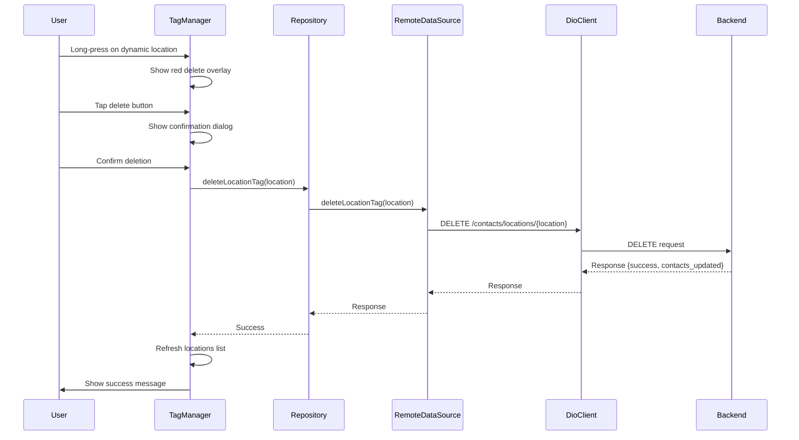

# Delete Location Tag Implementation Plan

## Overview

This plan outlines the implementation of deleting a dynamic location tag from all contacts. The feature consists of:
1. Adding a new backend API endpoint to delete location tags
2. Modifying the Edit/Add Location screen (TagManager widget) to support long-press delete

---

## Task 1: Add API Endpoint

### 1.1 Add Endpoint Constant
**File:** `lib/core/network/api_constants.dart`

Add a new constant for the delete location endpoint:
```dart
static const String deleteLocationTag = '/contacts/locations/{location_tag}';
```

### 1.2 Add Delete Method in DioClient
**File:** `lib/core/network/dio_client.dart`

Add method to handle DELETE request:
```dart
/// DELETE /contacts/locations/{location_tag}
/// Removes a location tag from all contacts
Future<Response> deleteLocationTag(String locationTag) async {
  final path = ApiConstants.deleteLocationTag.replaceAll(
    '{location_tag}',
    locationTag,
  );
  return delete(path);
}
```

### 1.3 Add Method in ContactRemoteDataSource
**File:** `lib/features/contacts/data/datasources/contact_remote_datasource.dart`

Add method to call the delete endpoint:
```dart
/// Delete a location tag from all contacts
/// Returns: { success: bool, deleted_location: string, contacts_updated: int, message: string }
Future<Map<String, dynamic>> deleteLocationTag(String locationTag) async {
  try {
    final endpoint = ApiConstants.deleteLocationTag.replaceAll(
      '{location_tag}',
      locationTag,
    );
    final response = await _dioClient.dio.delete(endpoint);
    return response.data as Map<String, dynamic>;
  } on DioException catch (e) {
    throw _handleDioError(e);
  }
}
```

---

## Task 2: Modify TagManager UI for Delete Functionality

### 2.1 Update TagManager Widget
**File:** `lib/features/contacts/presentation/widgets/tag_manager.dart`

The user wants:
- **Long-press interaction**: When user long-presses on a location in the dropdown, a red delete overlay appears
- **Only for dynamic locations**: Hardcoded locations (kanana, majaneng, mashemong, soshanguve, kekana) cannot be deleted

#### Changes Required:

1. **Import required dependencies:**
   - Add `package:flutter/services.dart` for HapticFeedback
   - Add the contact repository provider

2. **Add state for delete mode:**
   ```dart
   String? _locationToDelete;
   bool _isDeleting = false;
   ```

3. **Create helper to check if location is hardcoded:**
   ```dart
   static const Set<String> _hardcodedLocations = {
     'kanana', 'majaneng', 'mashemong', 'soshanguve', 'kekana'
   };
   
   bool _isHardcodedLocation(String value) {
     return _hardcodedLocations.contains(value.toLowerCase());
   }
   ```

4. **Modify `_buildLocationTile` to support long-press delete:**
   - Add GestureDetector with onLongPress
   - Show red delete overlay when `_locationToDelete == location.value`
   - Add delete icon button that triggers deletion

5. **Add confirmation dialog:**
   ```dart
   Future<bool?> _showDeleteConfirmation(String locationName, int affectedCount) {
     return showDialog<bool>(
       context: context,
       builder: (context) => AlertDialog(
         title: const Text('Delete Location'),
         content: Text(
           'Are you sure you want to delete "$locationName" from $affectedCount contacts?'),
         actions: [
           TextButton(onPressed: () => Navigator.pop(context, false), 
             child: const Text('Cancel')),
           TextButton(
             onPressed: () => Navigator.pop(context, true),
             style: TextButton.styleFrom(foregroundColor: Colors.red),
             child: const Text('Delete'),
           ),
         ],
       ),
     );
   }
   ```

6. **Add delete method:**
   ```dart
   Future<void> _deleteLocationTag(String locationValue) async {
     setState(() => _isDeleting = true);
     
     try {
       final repository = ref.read(contactRepositoryProvider);
       await repository.deleteLocationTag(locationValue);
       
       if (mounted) {
         ScaffoldMessenger.of(context).showSnackBar(
           SnackBar(content: Text('Location "$locationValue" deleted successfully')),
         );
         // Refresh the locations list
         await _loadLocations();
       }
     } catch (e) {
       if (mounted) {
         ScaffoldMessenger.of(context).showSnackBar(
           SnackBar(content: Text('Error: $e')),
         );
       }
     } finally {
       if (mounted) {
         setState(() {
           _isDeleting = false;
           _locationToDelete = null;
         });
       }
     }
   }
   ```

---

## Task 3: Update ContactRepository

### 3.1 Add Method in Repository Interface
**File:** `lib/features/contacts/domain/repositories/contact_repository.dart`

```dart
/// Delete a location tag from all contacts on the server
Future<Map<String, dynamic>> deleteLocationTag(String locationTag);
```

### 3.2 Add Implementation
**File:** `lib/features/contacts/data/repositories/contact_repository_impl.dart`

```dart
@override
Future<Map<String, dynamic>> deleteLocationTag(String locationTag) async {
  return await _remoteDataSource.deleteLocationTag(locationTag);
}
```

---

## Task 4: Hardcoded Locations List

The following 5 locations are **protected** and cannot be deleted:
- `kanana` - Kanana
- `majaneng` - Majaneng
- `mashemong` - Mashemong
- `soshanguve` - Soshanguve
- `kekana` - Kekana

---

## Implementation Flow



---

## Files to Modify

| File | Changes |
|------|---------|
| `lib/core/network/api_constants.dart` | Add `deleteLocationTag` constant |
| `lib/core/network/dio_client.dart` | Add `deleteLocationTag` method |
| `lib/features/contacts/data/datasources/contact_remote_datasource.dart` | Add `deleteLocationTag` method |
| `lib/features/contacts/domain/repositories/contact_repository.dart` | Add method signature |
| `lib/features/contacts/data/repositories/contact_repository_impl.dart` | Add method implementation |
| `lib/features/contacts/presentation/widgets/tag_manager.dart` | Add long-press delete UI |

---

## Notes

1. The delete operation is **server-side only** - it removes the location tag from ALL contacts that have it
2. The local database should refresh after successful deletion via the sync mechanism
3. Only online users can perform this operation (requires backend authentication)
4. The UI should handle loading states during deletion
5. Error handling should show user-friendly messages for:
   - Network errors
   - 400 errors (attempting to delete hardcoded location)
   - Server errors
