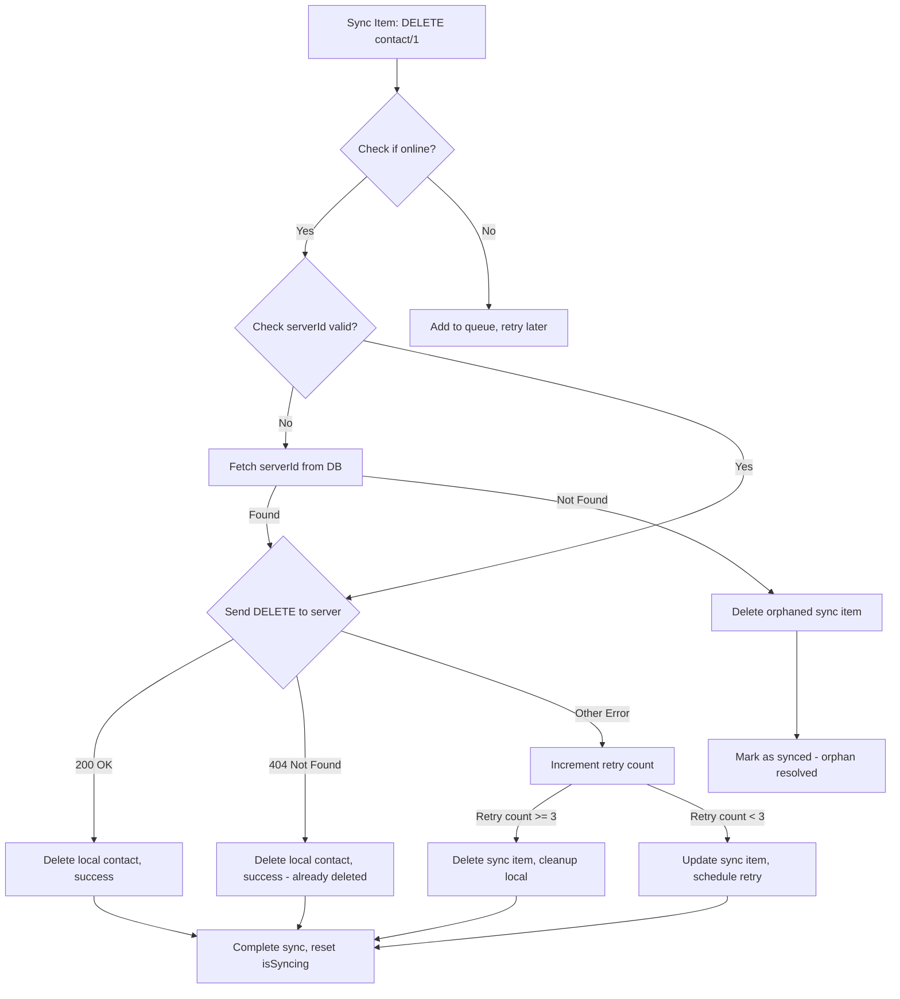

# Fix Plan: 404 Errors and Pending Dialog Stuck Issue

## Problem Analysis

### 1. 404 Error on DELETE /contacts/1
The logs show repeated `DELETE /contacts/1` returning `404 Not Found` - this indicates:
- The sync system is trying to delete a contact that no longer exists on the server
- Each retry creates a new log entry, indicating infinite retries were happening
- The contact with `server_id=1` was likely deleted on the server or never existed

### 2. Pending Dialog Stuck
The sync indicator shows "pending" even when:
- App is online
- Sync completed successfully
- This happens because `isSyncing` flag is not properly reset when:
  - 404 errors prevent proper sync completion
  - Failed items are not cleaned up from the sync queue
  - The `pendingCount` in `SyncStatus` is not refreshed after cleanup

## Root Causes

1. **404 Handling**: 404 errors (resource doesn't exist) should be treated as success (nothing to delete)
2. **Orphaned Sync Items**: Sync items with invalid `serverId` or for contacts that no longer exist locally
3. **isSyncing State**: Not properly reset when sync completes with failures
4. **Pending Count Not Updated**: After cleanup, `pendingCount` in state is stale

## Fix Implementation

### 1. Handle 404 as Success (Nothing to Delete)
In `sync_manager.dart`, modify `_syncContact` for delete action:

```dart
case 'delete':
  try {
    final deleteUrl = ApiConstants.contactById.replaceAll('{id}', serverId.toString());
    await _dioClient.delete(deleteUrl);
    await _db.deleteContact(localId);
  } on DioException catch (e) {
    // 404 means contact doesn't exist on server - consider it deleted successfully
    if (e.response?.statusCode == 404) {
      _logger.w('Contact $serverId not found on server (already deleted), cleaning up locally');
      await _db.deleteContact(localId); // Clean up local record
      return;
    }
    rethrow;
  }
  break;
```

### 2. Handle 404 in syncAll() Loop
Update the main sync loop to handle 404 as immediate success:

```dart
// Check if this is a 404 Not Found error
bool isNotFound = (e is DioException && e.response?.statusCode == 404) ||
                 (e is ApiException && e.statusCode == 404);

// For 404 errors, treat as success - resource doesn't exist
if (isNotFound) {
  _logger.w('Resource not found (404), deleting sync item without retry');
  await _db.deleteSyncQueueItem(item.id);
  
  // If it's a delete action for a non-existent resource, clean up local
  if (item.action == 'delete') {
    try {
      await _db.deleteContact(item.localId);
    } catch (_) {}
  }
  
  syncedCount++; // Count as success, not failure
  continue; // Skip to next item
}
```

### 3. Add Online Retry Limit (Max 3)
The `_maxRetryCount = 3` constant already exists, but we need to enforce it more aggressively:

```dart
// When app is online, strictly limit retries to 3
final effectiveMaxRetries = isOnline ? _maxRetryCount : _maxRetryCount * 2;

// Immediately delete items that exceed retry count
if (newRetryCount >= effectiveMaxRetries) {
  _logger.w('Max retries ($effectiveMaxRetries) exceeded for item ${item.id}, deleting');
  await _db.deleteSyncQueueItem(item.id);
  
  // For contacts, also clean up local record
  if (item.entityType == 'contact') {
    try {
      await _db.deleteContact(item.localId);
    } catch (_) {}
  }
  continue;
}
```

### 4. Reset isSyncing State Properly
In `sync_manager_provider.dart`, ensure `syncAll()` properly resets state:

```dart
Future<void> syncAll() async {
  state = state.copyWith(isSyncing: true, clearError: true);

  try {
    final result = await _syncManager.syncAll();
    final pendingCount = await _syncManager.getPendingSyncCount();

    // Always reset isSyncing, regardless of result
    // This fixes the "pending dialog stuck" issue
    state = state.copyWith(
      isSyncing: false,  // <-- This was missing or not always executed
      lastSyncTime: DateTime.now(),
      pendingCount: pendingCount,
      error: result.success ? null : result.message,
    );
  } catch (e) {
    // Also reset on exception
    state = state.copyWith(
      isSyncing: false,
      error: 'Sync failed: $e',
    );
  }
}
```

### 5. Improve aggressiveCleanupWhenOnline()
When coming online, immediately clean up:

```dart
Future<void> aggressiveCleanupWhenOnline() async {
  // Clear isSyncing if there are stale sync items stuck
  if (state.pendingCount > 0 && state.isSyncing) {
    // Check if sync has been "in progress" for too long
    // If > 5 minutes, assume it's stuck and reset
  }
  
  // Get all pending/failed items
  final items = await _db.getPendingSyncItems();
  
  for (final item in items) {
    // If item has been failed > 3 times, delete it
    if (item.retryCount >= _maxRetryCount) {
      await _db.deleteSyncQueueItem(item.id);
      
      // Also delete local contact if sync failed
      if (item.entityType == 'contact') {
        try {
          await _db.deleteContact(item.localId);
        } catch (_) {}
      }
    }
  }
  
  // Refresh pending count after cleanup
  await refreshPendingCount();
}
```

### 6. Ensure Pending Count Refresh After Cleanup
Add explicit pending count refresh:

```dart
// After aggressive cleanup
final newPendingCount = await _syncManager.getPendingSyncCount();
state = state.copyWith(pendingCount: newPendingCount);
```

## Mermaid Flowchart: 404 Error Handling



## Implementation Steps

1. [ ] Modify `_syncContact` in `sync_manager.dart` to handle 404 as success
2. [ ] Update `syncAll()` loop to count 404s as successful syncs
3. [ ] Ensure `isSyncing` is reset in `syncAll()` completion
4. [ ] Improve `aggressiveCleanupWhenOnline()` to clear stale items
5. [ ] Add explicit pending count refresh after cleanup
6. [ ] Test by simulating delete of non-existent contact