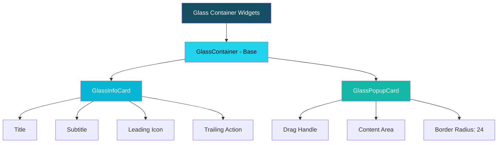

# Glass Container Widgets Plan

## Overview
Create reusable glassmorphism-style container/card widgets for the church attendance app, designed to work seamlessly with the dynamic gradient background.

## Design Philosophy
Based on the app's existing design system:
- **Cyan/teal accent** colors (primary: #06B6D4, #22D3EE)
- **Windows 11 inspired** dark mode with layered depth
- **Dynamic gradient background** with radial cyan accents
- **Light/Dark theme** support

## Widget Architecture

### 1. GlassContainer (Base Widget)
Core glassmorphism styling shared by all glass widgets:
- Semi-transparent background with blur effect
- Subtle border with theme-aware colors
- Configurable opacity, blur, border radius
- Supports both light and dark themes

### 2. GlassInfoCard
For displaying contact/attendance details on screens:
- Title + subtitle layout
- Optional leading icon/widget
- Optional trailing action
- Built on GlassContainer base

### 3. GlassPopupCard  
For bottom sheets and dialog containers:
- Rounded corners (24px for bottom sheets)
- Drag handle indicator option
- Content padding
- Built on GlassContainer base

## Mermaid Diagram

## Implementation Details

### GlassContainer Parameters
| Parameter | Type | Default | Description |
|-----------|------|---------|-------------|
| opacity | double | 0.15 | Background opacity |
| blur | double | 10.0 | Backdrop blur amount |
| borderRadius | double | 20.0 | Corner radius |
| borderOpacity | double | 0.2 | Border opacity |
| child | Widget | required | Content |

### GlassInfoCard Parameters
| Parameter | Type | Default | Description |
|-----------|------|---------|-------------|
| title | String | required | Main title text |
| subtitle | String? | null | Optional subtitle |
| leading | Widget? | null | Leading icon/widget |
| trailing | Widget? | null | Trailing action |
| onTap | VoidCallback? | null | Tap handler |

### GlassPopupCard Parameters
| Parameter | Type | Default | Description |
|-----------|------|---------|-------------|
| showDragHandle | bool | true | Show drag handle |
| dragHandleColor | Color? | null | Custom handle color |
| borderRadius | double | 24.0 | Corner radius |
| child | Widget | required | Content |

## Files to Create
1. `lib/core/widgets/glass_container.dart` - Base GlassContainer
2. `lib/core/widgets/glass_info_card.dart` - GlassInfoCard widget
3. `lib/core/widgets/glass_popup_card.dart` - GlassPopupCard widget
4. `lib/core/widgets/glass_widgets.dart` - Barrel export

## Theme Colors
Glass effect will use:
- **Light mode**: White at 10-20% opacity + cyan tint border
- **Dark mode**: #2C2C2C at 15-25% opacity + cyan border

## Next Steps
1. Switch to Code mode
2. Implement GlassContainer base widget
3. Implement GlassInfoCard
4. Implement GlassPopupCard
5. Create barrel export file
6. Test widgets with existing gradient background
