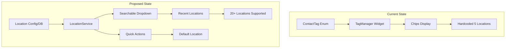

# UX Plan: Scaling Locations to 20+ (Balancing Ease of Use & Functionality)

## Problem Statement

Currently the app has 5 hardcoded locations. You need ~20 locations but:
- Current chip-based UI becomes overwhelming with 20 items
- Hardcoded enum makes adding locations difficult
- Users need fast ways to assign locations when adding/editing contacts
- Location data is used for post-service reporting

---

## Architecture Overview



---

## Solution Components

### 1. Make Locations Data-Driven (Not Hardcoded)

**Why:** Hardcoded enum requires code changes every time you add a location

**Implementation:**
- Store locations in local database table
- Add API endpoint for syncing locations (future)
- Locations become: `id`, `name`, `displayName`, `color`, `isActive`

**Files to modify:**
- `lib/core/database/database.dart` - Add locations table
- `lib/core/enums/contact_tag.dart` - Keep for roles only, extract locations

---

### 2. Replace Chips with Searchable Dropdown

**Why:** 20 chips = 3-4 rows of scrolling = slow selection

**Current UI (Problem):**
```
[Kanana] [Majaneng] [Mashemong] [Soshanguve] [Kekana] [+15 more...]
```

**Proposed UI (Solution):**
```
Location: ▼ Search or select...
           ├─ Recently Used
           │  ├─ Kanana ✓
           │  └─ Majaneng
           ├─ All Locations
           │  ├─ Kanana
           │  ├─ Majaneng
           │  ├─ Mashemong
           │  └─ ... (searchable)
           └─ + Add New Location
```

**Implementation:**
- Replace `_buildLocationChips()` with searchable `DropdownMenu`
- Show 3-5 recent locations at top
- Filter as user types

**Files to modify:**
- `lib/features/contacts/presentation/widgets/tag_manager.dart`

---

### 3. Add Default Location Setting

**Why:** Most users belong to one location - reduce repeated taps

**Implementation:**
- Add "Set as Default" option in location dropdown
- Store default in app preferences
- Pre-select default when creating new contacts

**New file:**
- `lib/core/services/location_preferences_service.dart`

---

### 4. Quick Location Assignment for Multiple Contacts

**Why:** Bulk importing or moving contacts between locations

**Implementation:**
- Add multi-select in contacts list
- "Change Location" bulk action
- Shows searchable dropdown for new location

**Files to modify:**
- `lib/features/contacts/screens/contact_list_screen.dart`
- `lib/features/contacts/presentation/providers/contact_provider.dart`

---

### 5. Enhanced Attendance Reporting by Location

**Why:** Show attendance breakdown by location after service

**Implementation:**
- Add location statistics card in attendance history
- Pie chart or bar chart showing attendance per location
- Tap location to see list of attendees from that location

**Files to modify:**
- `lib/features/attendance/presentation/screens/attendance_history_screen.dart`
- `lib/features/contacts/presentation/providers/tag_statistics_provider.dart`

---

## Implementation Steps

### Step 1: Create Location Database Table
- Add `locations` table to database
- Migration to convert current enum to table data

### Step 2: Extract Location Service
- Create `LocationService` to manage locations
- Methods: `getAll()`, `getRecent()`, `add()`, `setDefault()`

### Step 3: Update TagManager
- Replace chips with searchable dropdown
- Show recent locations first

### Step 4: Add Default Location
- Store preference locally
- Pre-fill on new contact creation

### Step 5: Enhance Reporting
- Add location breakdown in attendance history

---

## User Experience Comparison

| Task | Current (5 locations) | Proposed (20 locations) |
|------|---------------------|------------------------|
| Add new contact | Select from 5 chips | Search dropdown, shows recent |
| Edit contact location | Scroll through chips | Search & filter |
| Add new location | Code change required | UI option to add |
| View attendance by location | Not available | Visual breakdown |

---

## Priority Order

1. **P0 - Critical:** Make locations data-driven (not hardcoded)
2. **P1 - High:** Searchable dropdown for location selection
3. **P1 - High:** Recent locations quick access
4. **P2 - Medium:** Default location preference
5. **P2 - Medium:** Location-based attendance reporting
6. **P3 - Nice to have:** Bulk location update

---

## Files to Modify

- `lib/core/database/database.dart`
- `lib/core/enums/contact_tag.dart`
- `lib/features/contacts/presentation/widgets/tag_manager.dart`
- `lib/features/contacts/domain/models/contact.dart`
- `lib/features/contacts/presentation/providers/contact_provider.dart`
- `lib/features/attendance/presentation/screens/attendance_history_screen.dart`

## Files to Create

- `lib/core/services/location_service.dart`
- `lib/core/services/location_preferences_service.dart`
