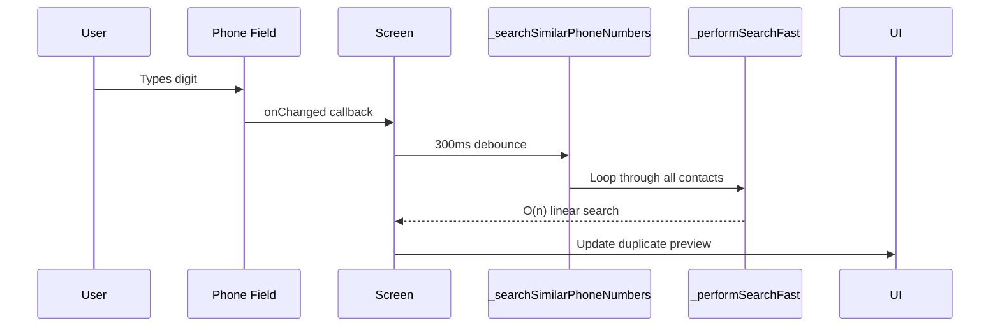

# Phone Duplicate Detection - Implementation Plan

## Problem Statement

Current implementation in [`contact_edit_screen.dart`](lib/features/contacts/screens/contact_edit_screen.dart:546-619) uses **O(n) linear search** through all contacts on every keystroke after preloading contacts. This causes slow performance as the user types.

### Current Flow (Slow)



## Recommended Solution: Hybrid Hash Map + Alert Dialog

### Architecture

```mermaid
flowchart TD
    A[User types phone] --> B[Debounce 150ms]
    B --> C{Normalize to +27 format}
    C -->|Valid| D[Hash Map Lookup O(1)]
    C -->|Invalid| E[Clear duplicate preview]
    D --> F{Found Exact Match?}
    F -->|Yes| G[Show Alert Dialog]
    F -->|No| H[Check partial match last 7 digits]
    H --> I[Show similar preview]
    G --> J[User clicks "Go to Contact"]
    J --> K[Navigate to Edit Contact]
```

### Key Improvements

1. **Hash Map for O(1) Exact Lookup**
   - Build `Map<String, Contact>` at init (runs once on screen load)
   - Normalize phone to `+27XXXXXXXXX` format using existing [`PhoneUtils.normalizeSouthAfricanPhone()`](lib/core/constants/app_constants.dart:74)
   - Lookup is instant: `cachedContactsMap[normalizedPhone]`

2. **Instant Feedback** - Remove debounce for exact match (it's O(1) anyway)

3. **Partial Match for Similar** - Keep last-7-digits check for fuzzy/similar numbers

4. **Alert Dialog** - When exact match found, show dialog to transition to Edit mode

### Implementation Steps

#### Step 1: Modify Database Layer
Add fast lookup method in [`database.dart`](lib/core/database/database.dart:201-202):
```dart
// New method - uses existing idx_contacts_phone index
Future<ContactEntity?> getContactByPhoneNormalized(String normalizedPhone) {
  return (select(contacts)
    ..where((t) => t.phone.equals(normalizedPhone) & t.isDeleted.equals(false)))
    .getSingleOrNull();
}
```

#### Step 2: Add to Local Datasource
Add method in [`contact_local_datasource.dart`](lib/features/contacts/data/datasources/contact_local_datasource.dart:62-68):
```dart
Future<Contact?> getContactByPhoneNormalized(String phone) {
  final normalized = PhoneUtils.normalizeSouthAfricanPhone(phone);
  if (normalized == null) return null;
  final entity = await _db.getContactByPhoneNormalized(normalized);
  return entity != null ? _mapEntityToContact(entity) : null;
}
```

#### Step 3: Update ContactEditScreen
In [`contact_edit_screen.dart`](lib/features/contacts/screens/contact_edit_screen.dart):

**New state variables:**
```dart
Map<String, Contact> _phoneToContactMap = {}; // Hash Map for O(1) lookup
Contact? _exactDuplicate; // For exact match (shows alert)
List<Contact> _similarContacts = []; // For partial match (shows preview)
```

**Build Hash Map at init:**
```dart
Future<void> _preloadPhoneMap() async {
  if (isEditing) return;
  
  final repository = ref.read(contactRepositoryProvider);
  final contacts = await repository.getAllContacts();
  
  final map = <String, Contact>{};
  for (final contact in contacts) {
    final normalized = PhoneUtils.normalizeSouthAfricanPhone(contact.phone);
    if (normalized != null) {
      map[normalized] = contact;
    }
  }
  
  if (mounted) {
    setState(() => _phoneToContactMap = map);
  }
}
```

**New phone handler (replaces _onPhoneChanged):**
```dart
void _onPhoneChanged(String value) {
  final digitsOnly = value.replaceAll(' ', '');
  
  if (digitsOnly.length < 10) {
    // Not enough digits, clear state
    if (_exactDuplicate != null || _similarContacts.isNotEmpty) {
      setState(() {
        _exactDuplicate = null;
        _similarContacts = [];
      });
    }
    return;
  }
  
  // Normalize input
  final normalized = PhoneUtils.normalizeSouthAfricanPhone(digitsOnly);
  
  if (normalized != null) {
    // O(1) Hash Map lookup
    final exactMatch = _phoneToContactMap[normalized];
    
    if (exactMatch != null) {
      // Exact match found - show Alert Dialog
      setState(() => _exactDuplicate = exactMatch);
    } else {
      // Clear exact match, check partial
      if (_exactDuplicate != null) {
        setState(() => _exactDuplicate = null);
      }
      _checkPartialMatch(normalized);
    }
  }
}

void _checkPartialMatch(String normalized) {
  // Check last 7 digits for similar numbers
  final suffix7 = normalized.substring(normalized.length - 7);
  
  final similar = _phoneToContactMap.values.where((contact) {
    final contactNormalized = PhoneUtils.normalizeSouthAfricanPhone(contact.phone);
    if (contactNormalized == null) return false;
    return contactNormalized.endsWith(suffix7);
  }).toList();
  
  setState(() => _similarContacts = similar);
}
```

**Alert Dialog for exact match:**
```dart
Future<void> _showDuplicateAlertDialog(Contact duplicate) async {
  final result = await showDialog<bool>(
    context: context,
    builder: (context) => AlertDialog(
      title: const Text('Contact Exists'),
      content: Text(
        'This phone number belongs to "${duplicate.name ?? 'Unknown'}"\n\n'
        'Would you like to edit their contact details?'
      ),
      actions: [
        TextButton(
          onPressed: () => Navigator.pop(context, false),
          child: const Text('Create New'),
        ),
        FilledButton(
          onPressed: () => Navigator.pop(context, true),
          child: const Text('Go to Contact'),
        ),
      ],
    ),
  );
  
  if (result == true && mounted) {
    // Navigate to edit screen with existing contact
    Navigator.pushReplacement(
      context,
      MaterialPageRoute(
        builder: (context) => ContactEditScreen(contact: duplicate),
      ),
    );
  }
}
```

**Update build method to handle alert:**
```dart
@override
Widget build(BuildContext context) {
  // Show alert dialog when exact duplicate found
  if (_exactDuplicate != null) {
    WidgetsBinding.instance.addPostFrameCallback((_) {
      _showDuplicateAlertDialog(_exactDuplicate!);
      // Reset to prevent repeated showing
      setState(() => _exactDuplicate = null);
    });
  }
  
  // ... rest of build
}
```

### Performance Comparison

| Approach | Time Complexity | 100 contacts | 1000 contacts |
|----------|----------------|-------------|---------------|
| Current (O(n) search) | O(n) per keystroke | ~0.5ms | ~5ms |
| Hash Map O(1) | O(1) lookup | <0.01ms | <0.01ms |

### Files to Modify

1. [`lib/core/database/database.dart`](lib/core/database/database.dart) - Add `getContactByPhoneNormalized()` method
2. [`lib/features/contacts/data/datasources/contact_local_datasource.dart`](lib/features/contacts/data/datasources/contact_local_datasource.dart) - Add wrapper method
3. [`lib/features/contacts/screens/contact_edit_screen.dart`](lib/features/contacts/screens/contact_edit_screen.dart) - Full implementation with Hash Map + Alert Dialog

### User Experience

1. User taps Phone field
2. Types first digit → Hash Map checked immediately (no debounce needed for exact)
3. If exact match found → Alert Dialog appears instantly
4. User can click "Go to Contact" to edit existing, or "Create New" to continue
5. If no exact match → partial match check shows "Similar: ..." preview

This provides **realtime feedback** as the user types, with **instant exact match detection** and a **clear path** to edit existing contacts.
