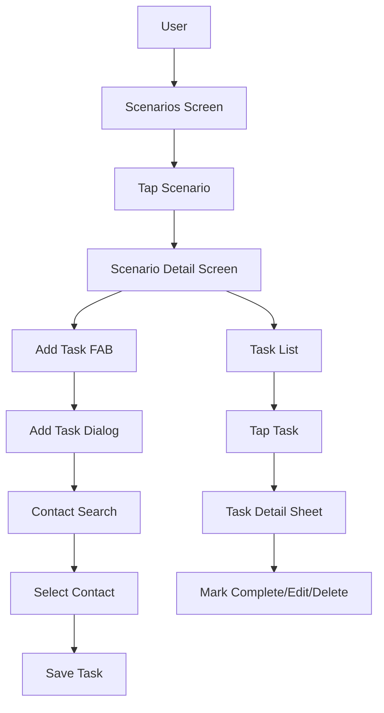
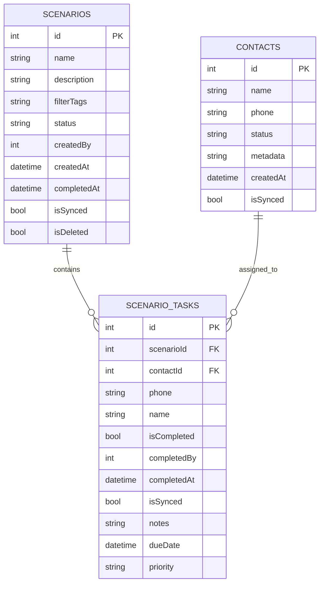

# Scenario Tasks Enhancement Plan

## Overview
Enhance the scenarios feature to allow creating and managing tasks/follow-ups for church outreach activities. This enables users to track contact attempts (calls, WhatsApp messages) without actually making the calls - just organizing and tracking who needs to be contacted.

## Current State
- ✅ Can create scenarios (name, description, filterTags)
- ✅ Can mark tasks as complete
- ❌ No UI to add contacts as tasks to a scenario
- ❌ No UI to view/manage tasks within a scenario
- ❌ No notes, due dates, or priority features

## Requirements Summary
1. **Add contacts manually** to scenarios as tasks
2. **Task notes** - track what happened (e.g., "left voicemail", "will call back")
3. **Due dates** - set when task should be completed
4. **Priority levels** - High/Medium/Low for task organization
5. **Better task UI** - view, filter, and manage tasks within scenarios

---

## Todo List

### Phase 1: Database & Model Updates

- [ ] **1.1** Add new columns to ScenarioTasks table in database.dart
  - Add `notes` column (text, nullable)
  - Add `dueDate` column (datetime, nullable) 
  - Add `priority` column (text, default 'medium')

- [ ] **1.2** Update ScenarioTask model in scenario.dart
  - Add `notes` field
  - Add `dueDate` field
  - Add `priority` field
  - Add `scenarioTaskPriority` enum for priority levels

- [ ] **1.3** Create scenario_task_priority.dart enum
  - Define High, Medium, Low priorities with colors

- [ ] **1.4** Regenerate freezed files for ScenarioTask

### Phase 2: Data Layer Updates

- [ ] **2.1** Update ScenarioLocalDataSource
  - Update `_mapEntityToScenarioTask()` to handle new fields
  - Update `createTask()` to accept notes, dueDate, priority
  - Add `updateTask()` method for editing tasks

- [ ] **2.2** Update ScenarioRepository interface
  - Add optional parameters to `createTask()` method
  - Add `updateTask()` method

- [ ] **2.3** Update ScenarioRepositoryImpl
  - Implement the new createTask parameters
  - Implement updateTask method

### Phase 3: Provider Updates

- [ ] **3.1** Update ScenarioNotifier in scenario_provider.dart
  - Add `createTask()` method with full parameters
  - Add `updateTask()` method
  - Add `deleteTask()` method
  - Add loadTasks method

### Phase 4: UI - Scenario Detail Screen

- [ ] **4.1** Create scenario_detail_screen.dart
  - Show scenario info header
  - Show task list with filtering (all/pending/completed)
  - Show progress indicator
  - Add FAB to add new task

- [ ] **4.2** Create task list widget
  - Display task cards with contact name, phone, priority badge
  - Show due date if set
  - Show completion status
  - Tap to view/edit task details
  - Checkbox to mark complete

### Phase 5: UI - Add Task Flow

- [ ] **5.1** Create add_task_dialog.dart
  - Contact selector (search existing contacts)
  - Priority dropdown (High/Medium/Low)
  - Due date picker
  - Notes text field

- [ ] **5.2** Create contact_search_widget.dart
  - Search contacts by name or phone
  - Show contact list with selection

### Phase 6: UI - Task Detail/Edit

- [ ] **6.1** Create task_detail_bottom_sheet.dart
  - View/edit contact info
  - Edit priority
  - Edit due date
  - Add/edit notes
  - Mark complete button
  - Delete task option

### Phase 7: Integration & Navigation

- [ ] **7.1** Update scenarios_screen.dart
  - Navigate to detail screen when tapping scenario card

- [ ] **7.2** Update app_navigation.dart
  - Add route for scenario detail

- [ ] **7.3** Update main_navigation_shell.dart
  - Link "To-do" to scenarios screen

### Phase 8: Additional Features (Optional)

- [ ] **8.1** Add filter by priority
- [ ] **8.2** Add filter by due date (overdue, today, this week)
- [ ] **8.3** Sort tasks by priority/due date
- [ ] **8.4** Add bulk actions (mark all complete)

---

## Architecture Diagram

## Database Schema Changes

## File Changes Summary

| File | Action |
|------|--------|
| lib/core/database/database.dart | Add columns to ScenarioTasks table |
| lib/features/scenarios/domain/models/scenario.dart | Add fields to ScenarioTask |
| lib/core/enums/scenario_task_priority.dart | New file - priority enum |
| lib/features/scenarios/data/datasources/scenario_local_datasource.dart | Update methods |
| lib/features/scenarios/domain/repositories/scenario_repository.dart | Update interface |
| lib/features/scenarios/data/repositories/scenario_repository_impl.dart | Update implementation |
| lib/features/scenarios/presentation/providers/scenario_provider.dart | Add provider methods |
| lib/features/scenarios/presentation/screens/scenario_detail_screen.dart | New file |
| lib/features/scenarios/presentation/screens/scenarios_screen.dart | Update navigation |
| lib/features/scenarios/presentation/widgets/task_list_widget.dart | New file |
| lib/features/scenarios/presentation/widgets/add_task_dialog.dart | New file |
| lib/features/scenarios/presentation/widgets/contact_search_widget.dart | New file |
| lib/features/scenarios/presentation/widgets/task_detail_sheet.dart | New file |
| lib/core/navigation/app_navigation.dart | Add route |
