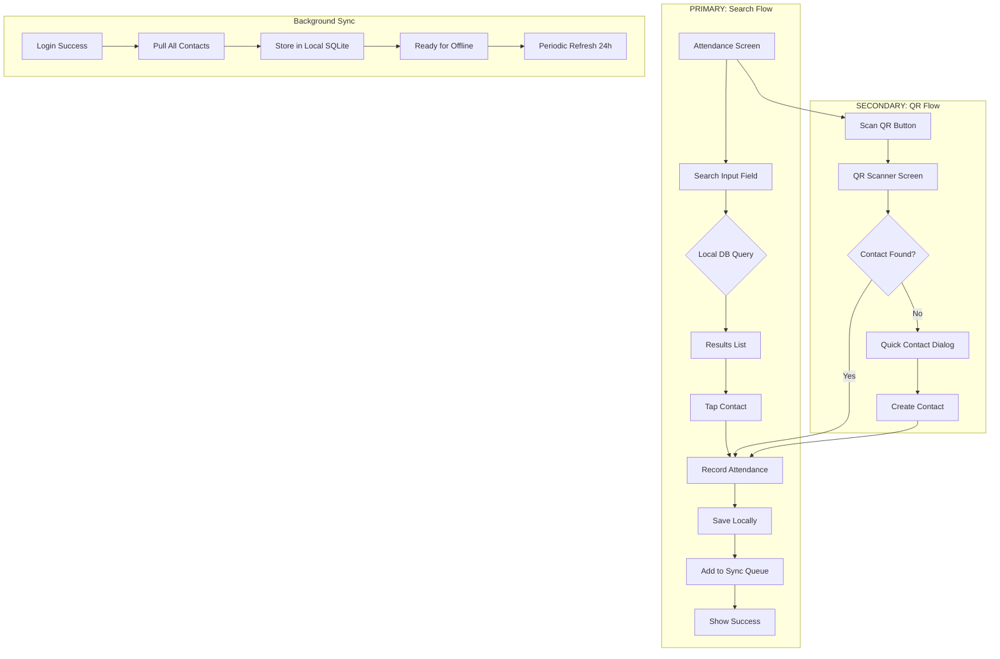

# Search-First Attendance Implementation Plan

## Problem Statement

The current implementation has QR scanning as the primary attendance method, but **Search MUST be primary** for time-sensitive attendance marking at church services. QR scanning should be secondary.

## Current State Analysis

### ✅ Already Implemented
- QR code scanning with `mobile_scanner` package
- Service type selection (Sunday, Tuesday, Special Event)
- Duplicate attendance prevention (one per day/service)
- Quick contact creation when QR scan finds no contact
- Offline-first architecture with Drift database
- Sync queue support for offline operations
- [`searchContacts()`](lib/core/database/database.dart:144) method in database

### ❌ Missing / Needs Change
1. **No search UI on attendance screen** - Only QR button exists
2. **No initial contact pull on login** - `pullContacts()` exists but never called
3. **No sync status indicator** - Users can't see offline readiness
4. **No offline contact count** - Can't verify data availability

---

## Architecture Flow (Updated)



---

## Implementation Plan

### Phase 1: Search-First UI (Priority: HIGH)

#### 1.1 Update Attendance Screen
**File:** [`lib/features/attendance/presentation/screens/attendance_screen.dart`](lib/features/attendance/presentation/screens/attendance_screen.dart:1)

**Changes:**
- Add prominent search field at top
- Show contact results list below search
- Move QR button to secondary position (bottom or FAB)
- Add service type selector above search

**New Layout:**
```
┌─────────────────────────────────┐
│  Select Service                 │
│  [Sunday] [Tuesday] [Special]   │
├─────────────────────────────────┤
│  🔍 Search by name or phone...  │  ← PRIMARY
├─────────────────────────────────┤
│  Contact Results                │
│  ┌─────────────────────────┐   │
│  │ 👤 John Doe    [MEMBER] │   │  ← Member highlighted
│  │    +27 82 123 4567      │   │
│  └─────────────────────────┘   │
│  ┌─────────────────────────┐   │
│  │ ✓ Jane Smith  [MEMBER]  │   │  ← Already marked (grayed)
│  │    +27 83 987 6543  ✓   │   │     with checkmark
│  └─────────────────────────┘   │
│  ┌─────────────────────────┐   │
│  │ 👤 Mike Ross            │   │  ← Non-member (no badge)
│  │    +27 84 555 1234      │   │
│  └─────────────────────────┘   │
│                                 │
│                     ┌─────┐    │
│                     │ 📷  │    │  ← FAB (QR Scanner)
│                     └─────┘    │     SECONDARY
└─────────────────────────────────┘
```

#### 1.2 Create Contact Search Provider
**File:** `lib/features/attendance/presentation/providers/contact_search_provider.dart` (NEW)

```dart
/// Provider for searching contacts locally
final contactSearchProvider = StateNotifierProvider<ContactSearchNotifier, ContactSearchState>((ref) {
  final database = ref.watch(databaseProvider);
  return ContactSearchNotifier(database);
});

class ContactSearchState {
  final String query;
  final List<ContactEntity> results;
  final bool isLoading;
  
  // Debounced search - queries local DB only
  Future<void> search(String query) async {
    // No API calls! Pure local DB query
    results = await _db.searchContacts(query);
  }
}
```

#### 1.3 Create Contact Result Card Widget
**File:** `lib/features/attendance/presentation/widgets/contact_result_card.dart` (NEW)

Features:
- Show contact name and phone
- **Member badge** for contacts with 'member' tag
- **Already marked indicator**: Checkmark badge + grayed out for duplicates
- Tap to mark attendance
- Visual feedback on tap

```dart
class ContactResultCard extends ConsumerWidget {
  final ContactEntity contact;
  final ServiceType serviceType;
  final bool isAlreadyMarked;  // From attendance check
  
  @override
  Widget build(BuildContext context, WidgetRef ref) {
    return Opacity(
      opacity: isAlreadyMarked ? 0.5 : 1.0,
      child: ListTile(
        leading: CircleAvatar(
          child: isAlreadyMarked 
              ? Icon(Icons.check, color: Colors.green)
              : Icon(Icons.person),
        ),
        title: Row(
          children: [
            Text(contact.name ?? contact.phone),
            if (contact.hasTag('member'))
              Container(
                margin: EdgeInsets.only(left: 8),
                padding: EdgeInsets.symmetric(horizontal: 6, vertical: 2),
                decoration: BoxDecoration(
                  color: Colors.blue,
                  borderRadius: BorderRadius.circular(4),
                ),
                child: Text('MEMBER', style: TextStyle(fontSize: 10, color: Colors.white)),
              ),
          ],
        ),
        subtitle: Text(contact.phone),
        trailing: isAlreadyMarked 
            ? Icon(Icons.check_circle, color: Colors.green)
            : null,
        onTap: isAlreadyMarked ? null : () => _markAttendance(),
      ),
    );
  }
}
```

---

### Phase 2: Initial Sync on Login (Priority: HIGH)

#### 2.1 Update Auth Provider
**File:** [`lib/features/auth/presentation/providers/auth_provider.dart`](lib/features/auth/presentation/providers/auth_provider.dart:100)

**Add after successful login:**
```dart
Future<bool> login(String email, String password) async {
  // ... existing login logic ...
  
  if (success) {
    // Pull all contacts on first login
    final syncManager = ref.read(syncManagerProvider);
    await syncManager.pullContacts();
    
    // Store last sync timestamp
    await _prefs.setLastSyncTime(DateTime.now());
  }
  
  return success;
}
```

#### 2.2 Create Sync Manager Provider
**File:** `lib/core/sync/sync_manager_provider.dart` (NEW)

```dart
final syncManagerProvider = Provider<SyncManager>((ref) {
  final database = ref.watch(databaseProvider);
  final dioClient = ref.watch(dioClientProvider);
  return SyncManager(database, dioClient);
});
```

---

### Phase 3: Sync Status UI (Priority: MEDIUM)

#### 3.1 Create Sync Status Widget
**File:** `lib/core/presentation/widgets/sync_status_indicator.dart` (NEW)

```dart
class SyncStatusIndicator extends ConsumerWidget {
  @override
  Widget build(BuildContext context, WidgetRef ref) {
    final syncStatus = ref.watch(syncStatusProvider);
    
    return Row(
      children: [
        Icon(
          syncStatus.isSynced ? Icons.cloud_done : Icons.cloud_off,
          size: 16,
          color: syncStatus.isSynced ? Colors.green : Colors.orange,
        ),
        SizedBox(width: 4),
        Text(
          'Last synced: ${syncStatus.timeAgo}',
          style: TextStyle(fontSize: 12, color: Colors.grey),
        ),
      ],
    );
  }
}
```

#### 3.2 Add to Home Screen
**File:** [`lib/features/home/presentation/screens/home_screen.dart`](lib/features/home/presentation/screens/home_screen.dart:1)

Add sync status indicator in app bar or header.

---

### Phase 4: Offline Contact Count (Priority: MEDIUM)

#### 4.1 Create Contact Count Provider
**File:** `lib/features/contacts/presentation/providers/contact_count_provider.dart` (NEW)

```dart
final offlineContactCountProvider = FutureProvider<int>((ref) async {
  final database = ref.watch(databaseProvider);
  return await database.getAllContacts().then((contacts) => contacts.length);
});
```

#### 4.2 Display in Settings or Home
```dart
Text('3,245 contacts available offline')
```

---

### Phase 5: Periodic Background Sync (Priority: LOW)

#### 5.1 Add Periodic Sync
**File:** [`lib/core/sync/sync_manager.dart`](lib/core/sync/sync_manager.dart:1)

```dart
/// Start periodic sync every 24 hours
void startPeriodicSync() {
  Timer.periodic(Duration(hours: 24), (_) async {
    if (await hasInternetConnection()) {
      await pullContacts();
      await syncAll(); // Also push pending items
    }
  });
}
```

#### 5.2 Initialize in Main
**File:** [`lib/main.dart`](lib/main.dart:1)

```dart
void main() async {
  // ... existing setup ...
  
  // Start periodic sync if user is authenticated
  if (await isAuthenticated()) {
    final syncManager = ref.read(syncManagerProvider);
    syncManager.startPeriodicSync();
  }
}
```

---

### Phase 6: Search Optimization (Priority: LOW)

#### 6.1 Add Database Indexes
**File:** [`lib/core/database/database.dart`](lib/core/database/database.dart:110)

```dart
@override
MigrationStrategy get migration {
  return MigrationStrategy(
    onCreate: (Migrator m) async {
      await m.createAll();
      // Add indexes for faster search
      await customStatement('CREATE INDEX idx_contact_name ON contacts(name)');
      await customStatement('CREATE INDEX idx_contact_phone ON contacts(phone)');
    },
    onUpgrade: (Migrator m, int from, int to) async {
      if (from < 2) {
        await customStatement('CREATE INDEX idx_contact_name ON contacts(name)');
        await customStatement('CREATE INDEX idx_contact_phone ON contacts(phone)');
      }
    },
  );
}
```

---

## Files to Create/Modify

### New Files
```
lib/
  core/
    presentation/widgets/
      sync_status_indicator.dart       # NEW
    sync/
      sync_manager_provider.dart       # NEW
  features/
    attendance/presentation/
      providers/
        contact_search_provider.dart   # NEW
      widgets/
        contact_result_card.dart       # NEW
    contacts/presentation/providers/
      contact_count_provider.dart      # NEW
```

### Modified Files
```
lib/
  features/attendance/presentation/screens/
    attendance_screen.dart             # MAJOR UPDATE
  features/auth/presentation/providers/
    auth_provider.dart                 # ADD initial sync
  features/home/presentation/screens/
    home_screen.dart                   # ADD sync indicator
  core/database/
    database.dart                      # ADD indexes
  core/sync/
    sync_manager.dart                  # ADD periodic sync
  main.dart                            # INIT periodic sync
```

---

## Verification Checklist

| Item | Status | Notes |
|------|--------|-------|
| Contacts stored locally in Drift | ✅ | Already working |
| Search queries local DB (no API) | ✅ | Method exists, UI missing |
| Attendance saves to sync queue | ✅ | Already working |
| Search is PRIMARY method | ❌ | **Needs implementation** |
| QR is SECONDARY method | ❌ | Currently primary |
| Initial contact pull on login | ❌ | **Needs implementation** |
| Periodic background sync | ❌ | Optional enhancement |
| Show offline contact count | ❌ | Optional enhancement |
| Last synced indicator | ❌ | Optional enhancement |

---

## User Flow Comparison

### Before (Current)
```
Open App → Select Service → Tap Scan QR → Point Camera → Mark Attendance
                    ↑
                  PRIMARY (wrong)
```

### After (Proposed)
```
Open App → Select Service → Type Name → Tap Result → Mark Attendance
                    ↑                           ↑
                  PRIMARY                    INSTANT (local DB)

Alternative:
Open App → Select Service → Tap Scan QR → Point Camera → Mark Attendance
                                      ↑
                                   SECONDARY (for members with QR)
```

---

## Implementation Order

1. **Phase 1** - Search-First UI (critical for time-sensitive marking)
2. **Phase 2** - Initial Sync on Login (enables offline-first)
3. **Phase 3** - Sync Status UI (user confidence)
4. **Phase 4** - Offline Contact Count (verification)
5. **Phase 5** - Periodic Background Sync (optimization)
6. **Phase 6** - Search Optimization (performance)

---

## Design Decisions (Confirmed)

1. **Search scope**: Show ALL contacts but highlight members visually (e.g., member badge/icon)
2. **Already marked indicator**: Show checkmark badge and gray out already-marked contacts
3. **QR button position**: Floating Action Button (FAB) in bottom-right corner
4. **Periodic sync**: Implement as background feature (no settings UI needed for now)
