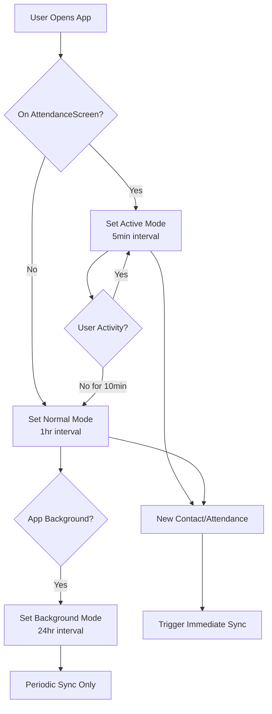

# Smart Sync Strategy Plan

## Current Behavior (Problems)
- Sync interval is fixed at 1 hour (or 24 hours)
- No awareness of user activity context
- New contacts/attendance may wait up to 1 hour before syncing
- Users marking attendance or adding contacts need faster sync

## Proposed Smart Sync Solution

### 1. Context-Aware Sync Intervals

| Mode | Interval | Trigger Condition |
|------|----------|-------------------|
| **Active Mode** | 5 minutes | User is on AttendanceScreen or actively editing contacts |
| **Normal Mode** | 1 hour | User is logged in but not actively marking attendance |
| **Background Mode** | 24 hours | App is in background or idle for >30 minutes |
| **Immediate** | Instant | Critical events (new contact, attendance recorded) |

### 2. Event-Driven Immediate Sync

Sync immediately when these events occur (if online):
- [ ] New contact created via QuickContactDialog
- [ ] Attendance recorded (via QR scan or manual)
- [ ] Contact updated with new information
- [ ] Bulk VCF import completed
- [ ] Contact deleted

### 3. Activity-Based Mode Switching

**Mode Detection Logic:**
```dart
enum SyncMode { active, normal, background }

// Active Mode triggers:
- User navigates to AttendanceScreen
- User opens QuickContactDialog
- User is on ContactsScreen and creates/updates a contact

// Normal Mode triggers:
- User leaves AttendanceScreen (navigates away)
- No sync-critical activity for 10 minutes
- App returns to foreground after being in background

// Background Mode triggers:
- App goes to background
- No user activity for 30 minutes
```

### 4. Implementation Changes Required

#### A. Modify `sync_manager_provider.dart`
- Add `SmartSyncNotifier` to track current sync mode
- Add method `setSyncMode(SyncMode mode)`
- Update `PeriodicSyncNotifier` to respect current mode interval
- Add event-driven sync trigger

#### B. Modify `attendance_screen.dart`
- On `initState`: Call `setSyncMode(SyncMode.active)`
- On `dispose`: Call `setSyncMode(SyncMode.normal)`
- Track last activity timestamp

#### C. Modify `quick_contact_dialog.dart`
- On successful contact creation: Trigger immediate sync
- Set active mode while dialog is open

#### D. Modify `contact_result_card.dart`
- After `recordAttendance`: Trigger immediate sync of pending items

#### E. Modify `sync_manager.dart`
- Add `syncPendingItems()` for quick sync without full pull
- Add `triggerImmediateSync()` for event-driven sync

### 5. Configuration

```dart
class SyncConfig {
  static const Duration activeModeInterval = Duration(minutes: 5);
  static const Duration normalModeInterval = Duration(hours: 1);
  static const Duration backgroundModeInterval = Duration(hours: 24);
  static const Duration inactivityThreshold = Duration(minutes: 10);
  static const Duration backgroundThreshold = Duration(minutes: 30);
}
```

### 6. Benefits

1. **Faster Data Sync During Active Use**: Contacts created during attendance marking sync within 5 minutes
2. **Better Battery Life**: Normal background sync stays at 1-24 hours
3. **Event-Driven Reliability**: Critical operations sync immediately
4. **Transparent to Users**: No manual sync needed in most cases

### 7. Implementation Steps

1. [ ] Create SmartSyncNotifier with mode tracking
2. [ ] Modify PeriodicSyncNotifier to use dynamic intervals
3. [ ] Add event-driven sync triggers to attendance/contact flows
4. [ ] Add mode switching to AttendanceScreen lifecycle
5. [ ] Test sync behavior in different scenarios
6. [ ] Update UI indicators to show active sync mode

## Visual Flow


