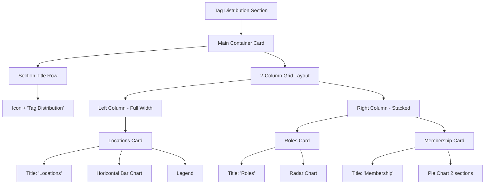

# Tag Distribution Charts Transformation Plan

## Overview
Transform the single Tag Distribution pie chart in `home_screen.dart` into three separate, beautiful charts organized by category.

## Current State
- **File**: [`lib/features/home/presentation/screens/home_screen.dart`](lib/features/home/presentation/screens/home_screen.dart:1132)
- **Current Implementation**: Single pie chart showing all tags (lines 1132-1275)
- **Providers Available**: Already exists in [`lib/features/contacts/presentation/providers/tag_statistics_provider.dart`](lib/features/contacts/presentation/providers/tag_statistics_provider.dart:1)

## Requirements

### Categories to Create
1. **Locations** (Red color: #F44336)
   - Tags: mashemong, kanana, majaneng, kekana, soshanguve
   - Chart Type: **Horizontal Bar Chart** (BarChart with horizontal bars)

2. **Roles** (Purple/Blue colors)
   - Tags: pastor, protocol, worshiper, usher, financier, servant
   - Chart Type: **Radar Chart** (RadarChart - spider/radar layout)

3. **Membership** (Green: #8BC34A)
   - Tags: member vs non-member
   - Chart Type: **Pie chart with 2 sections** or progress indicator

### Layout Improvements
- Replace vertical stacking with a 2-column grid or staggered layout
- Add card containers with titles for each category
- Use proper spacing and styling with gradients, tooltips

---

## Implementation Steps

### Step 1: Replace `_buildTagDistributionChart` method
Replace the current single pie chart implementation (lines 1132-1275) with a new method that builds three separate charts in a grid layout.

### Step 2: Create horizontal bar chart for Locations
```dart
Widget _buildLocationBarChart(Map<ContactTag, int> locationCounts)
```
- Use `BarChart` with horizontal bars (`barChartGroupData` with horizontal orientation)
- Red color gradient for bars
- Location names on Y-axis, counts on X-axis
- Tooltips showing exact counts

### Step 3: Create radar chart for Roles
```dart
Widget _buildRoleRadarChart(Map<ContactTag, int> roleCounts)
```
- Use `RadarChart` from fl_chart
- Purple/blue color scheme for different roles
- Spider/radar layout showing role distribution
- Tooltips on hover

### Step 4: Create membership pie/gauge chart
```dart
Widget _buildMembershipChart(Map<String, int> membershipCounts)
```
- Simple pie chart with 2 sections (Member vs Non-Member)
- Green color theme
- Show percentage and counts

### Step 5: Layout with 2-column grid
```dart
Widget _buildTagDistributionSection(...)
```
- Row with two columns:
  - Left column: Locations (full width horizontal bar chart)
  - Right column: Roles (radar) + Membership (pie) stacked
- Use `Expanded` widgets and proper `SizedBox` for spacing

---

## Mermaid Diagram: Target Layout



---

## Data Providers (Already Exist)

The following providers are already available in [`tag_statistics_provider.dart`](lib/features/contacts/presentation/providers/tag_statistics_provider.dart):

1. **locationTagDistributionProvider** (line 51)
   - Returns `FutureProvider<Map<ContactTag, int>>`
   - Filters tags to only location tags

2. **roleTagDistributionProvider** (line 77)
   - Returns `FutureProvider<Map<ContactTag, int>>`
   - Filters tags to only role tags

3. **membershipDistributionProvider** (line 103)
   - Returns `FutureProvider<Map<String, int>>`
   - Returns 'Member' and 'Non-Member' counts

---

## File Modifications Required

| File | Lines | Modification |
|------|-------|--------------|
| [`lib/features/home/presentation/screens/home_screen.dart`](lib/features/home/presentation/screens/home_screen.dart) | 1132-1275 | Replace entire `_buildTagDistributionChart` method |

---

## Key Implementation Details

### Chart Colors
- **Locations**: Red (#F44336) - from `ContactTag.locationTags[0].color`
- **Roles**: Purple/Blue palette - use individual tag colors from enum
- **Membership**: Green (#8BC34A) for member, Gray for non-member

### Chart Sizes
- Location Bar Chart: Height ~200px
- Role Radar Chart: Height ~180px  
- Membership Pie Chart: Height ~150px

### Graceful Handling
- Show "No data" message if category has no tags
- Loading state: Show `CircularProgressIndicator`
- Error state: Return `SizedBox.shrink()`

---

## Validation Checklist

- [ ] Horizontal bar chart displays for Locations
- [ ] Radar chart displays for Roles  
- [ ] 2-section pie chart displays for Membership
- [ ] Layout is visually appealing (2-column grid)
- [ ] Each chart has proper title and card container
- [ ] Tooltips work on all charts
- [ ] Graceful handling of empty data states
- [ ] Uses existing providers (no new providers needed)
