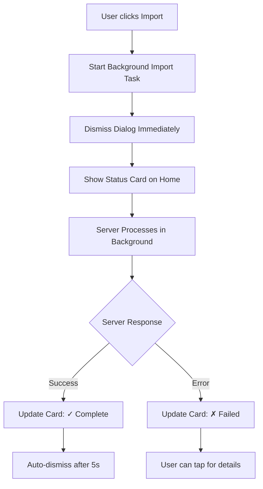

# VCF Import UX Improvement Plan

## Current Analysis

### Current Flow (Problem)
1. User shares/receives VCF file → Detected via polling/MethodChannel
2. VCF parsed for preview (shows contact count, sample names)
3. User clicks "Import" → **WAITS** for server response (blocking)
4. Server processes VCF → Returns result `{success, imported_count, updated_count, failed_count, errors}`
5. Shows result dialog

### Issues
- User is blocked waiting for server response
- No real-time progress indication
- Dialog cannot be dismissed during import
- Poor UX when server takes time

---

## Proposed Solution: Fire-and-Forget with Background Processing

### Core Strategy
1. **Immediate Optimistic Response** - Close dialog immediately after starting import
2. **Background Processing** - Server processes VCF asynchronously
3. **Result Notification** - Show popup when server completes (via polling or callback)

---

## Implementation Options

### Option A: Persistent Status Card (Recommended)
- Show a dismissible status card on Home Screen
- Updates in real-time: "Importing 5 contacts..." → "✓ Import complete: 5 imported, 3 updated"
- User can continue using the app while import runs
- Card auto-dismisses after few seconds on success, stays on error

### Option B: Toast/Snackbar
- Close dialog immediately
- Show brief progress snackbar
- Display result snackbar when done
- Less intrusive, but easy to miss

### Option C: Background Notification
- Close dialog immediately  
- Send local notification when done
- Works even if app is in background
- Best for large imports

---

## Recommended Approach: Option A (Persistent Status Card)

### Architecture



---

## Implementation Steps

### Step 1: Modify VcfShareIntentProvider
- Add new state for "background processing"
- Create method to start fire-and-forget import
- Don't await server response in UI

### Step 2: Create Background Import Service
- Use isolate or simple async fire-and-forget
- Poll for result OR listen for completion callback
- Update provider state on completion

### Step 3: Update VcfImportOverlay
- Change "Import" button to start background process
- Close overlay immediately after starting
- Remove "importing" state UI (since we don't wait)

### Step 4: Create ImportStatusCard Widget
- Dismissible card showing import progress/completion
- Position: Top of Home Screen
- States: starting, importing (n contacts), success, error

### Step 5: Show Result Popup
- When server completes, show VcfImportResultDialog
- Can be triggered from status card tap or automatic

---

## Files to Modify

| File | Changes |
|------|---------|
| `vcf_share_intent_provider.dart` | Add background import methods, polling for result |
| `vcf_import_overlay.dart` | Update to start background import, close immediately |
| `vcf_import_dialog.dart` | May add new status card widget |
| `home_screen.dart` | Add ImportStatusCard to widget tree |

---

## API Response Format (Confirmed)
```json
{
  "success": true,
  "imported_count": 5,
  "updated_count": 3,
  "failed_count": 0,
  "errors": []
}
```

---

## UX Improvements Summary

| Before | After |
|--------|-------|
| Blocked waiting for server | Immediate dialog close |
| Static spinner | Real-time status card |
| Can't use app during import | Full app usability |
| Single result dialog | Status card + optional detailed popup |
| No progress indication | Shows "X contacts importing..." |
